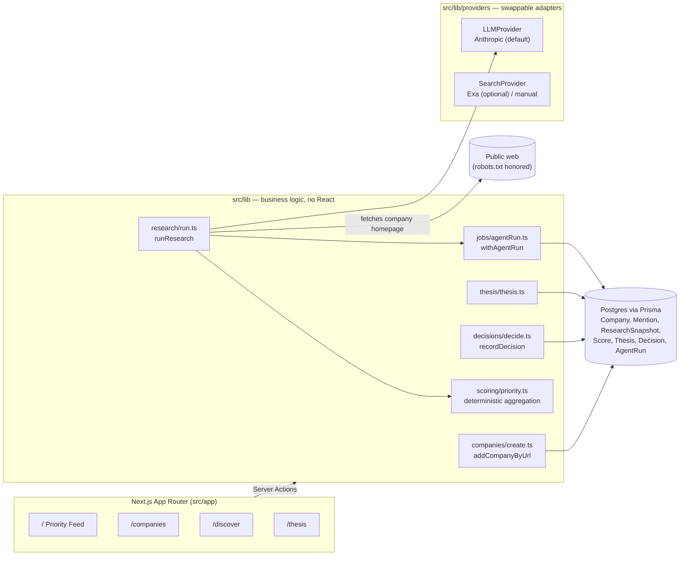

# SourceOS

An opinionated, AI-native startup sourcing system for one investor — not a
generic CRM. It discovers companies, turns public signals into structured
records, researches and scores them against your own investment thesis, and
keeps every observation as a timestamped, append-only mention so your
reasoning is reconstructable later.

**Status: early build.** The manual intelligence loop (add a company →
evidence-backed research → deterministic scoring → decide) is fully working
end-to-end against a real LLM and a real database. Autonomous sourcing,
monitoring, and taste-learning are not implemented yet — see
[docs/BUILD_PLAN.md](docs/BUILD_PLAN.md) for the exact boundary and what's
next.

## Architecture



Business logic lives entirely in `src/lib/` — page components call server
actions (`"use server"` files next to the pages that use them), which call
into `lib/`. Nothing talks to Prisma or Anthropic directly from a React
component.

## Local setup

```bash
npm install
cp .env.example .env.local   # fill in DATABASE_URL and ANTHROPIC_API_KEY
npm run db:migrate           # applies the schema to your Postgres database
npm run db:seed              # default Thesis + 6 fictional demo companies
npm run dev                  # http://localhost:3000
```

Requires a Postgres database (see [Database](#database) below) and, to
enable "Run research", `ANTHROPIC_API_KEY`.

## Environment variables

See [.env.example](.env.example) for the full list with comments. Summary:

| Variable | Required | Purpose |
| --- | --- | --- |
| `DATABASE_URL` | Yes | Postgres connection string |
| `ANTHROPIC_API_KEY` | Only for research/scoring | Powers company-analyst + thesis-matcher |
| `ANTHROPIC_MODEL` | No | Defaults to `claude-sonnet-5` |
| `EXA_API_KEY` | No | Optional web-search adapter; not called by anything yet |

## Database

Postgres via Prisma, using the `@prisma/adapter-pg` driver adapter (Prisma 7
requires a driver adapter for the SQL provider workflow — see
`src/lib/db/client.ts`). Any Postgres works; in production this runs on
[Neon](https://neon.tech), provisioned through Vercel's marketplace
integration. List/array fields (sectors, signals, etc.) are native
Postgres `String[]` columns; only genuinely object-shaped fields
(evidence, thesis weights, agent run inputs/outputs) stay `Json`.

```bash
npm run db:migrate   # apply schema changes
npm run db:seed      # idempotent — safe to re-run
npm run db:studio    # browse the data
```

## How to add a company

UI: `/discover` → paste a URL → optionally check "run research immediately".

Code: `addCompanyByUrl` (`src/lib/companies/create.ts`) — idempotent on
canonical domain, so re-adding a known company returns the existing row
instead of duplicating it.

## How to run research

UI: "Run research" / "Re-research" button on any company page or the
Priority Feed.

Code: `runResearch(companyId)` (`src/lib/research/run.ts`). Fetches the
company's public homepage (honors `robots.txt`), runs company-analyst
(evidence-backed snapshot, FACT/INFERENCE-tagged), then thesis-matcher
(nine dimension scores against the active Thesis), computes the weighted
score and priority deterministically, and records every step as an
`AgentRun` (visible on `/runs`). Fails cleanly with `LLMNotConfiguredError`
if `ANTHROPIC_API_KEY` isn't set.

## How to run sourcing / monitoring / generate a brief / run reflection

**Not implemented yet.** Each has a `.claude/skills/<name>/SKILL.md` file
that states the honest current status and the manual fallback (mostly:
call `addCompanyByUrl` / `runResearch` in a loop from a `tsx` script). See
[docs/BUILD_PLAN.md](docs/BUILD_PLAN.md) for what a real implementation
needs.

## How cron automation works

**Not implemented yet.** No `scripts/daily-*.ts` files exist, so there's
nothing in `package.json` pointing at a missing script. When source/monitor
scripts exist, the intended pattern (per `CLAUDE.md`) is plain Node/tsx
entrypoints invoked by any external scheduler (`cron`, Vercel Cron, GitHub
Actions) — each run wrapped in an `AgentRun` via `withAgentRun`
(`src/lib/jobs/agentRun.ts`) so it's auditable on `/runs` exactly like a
UI-triggered research run.

## Provider configuration

- **LLM**: `src/lib/providers/llm/` — `LLMProvider` interface,
  `AnthropicLLMProvider` implementation. Structured output is always
  validated against a Zod schema (`src/lib/schemas/`) via Anthropic's
  `output_config.format`; a schema mismatch triggers one retry with explicit
  feedback before failing loudly. `getLLMProvider()` is the only place a new
  provider would be registered.
- **Search**: `src/lib/providers/search/` — `SearchProvider` interface, an
  optional Exa adapter, and a no-op `ManualSearchProvider` fallback so the
  app never requires a search API key to boot.

## Testing

```bash
npm test          # Vitest, run once
npm run test:watch
npx tsc --noEmit  # strict type check
npx eslint .
```

Current coverage: 40 unit tests over the pure functions that matter most for
correctness — domain canonicalization, weighted-score aggregation,
freshness/novelty factors, the sourcing-queue state machine (including that
failure states are terminal), and every Zod schema an LLM call writes
through. No integration or E2E tests yet (Phase 7, not built this session) —
the manual intelligence loop has instead been verified by hand against the
real Postgres database and the running dev server (see
[docs/BUILD_PLAN.md](docs/BUILD_PLAN.md)).

## Deployment

Deployed on Vercel, backed by a Neon Postgres database provisioned through
Vercel's marketplace integration. Standard Next.js deployment (`npm run
build && npm start`) — the only things beyond a default Vercel deploy are
`DATABASE_URL` (set by the Neon integration) and `ANTHROPIC_API_KEY` /
`ANTHROPIC_MODEL` as project environment variables.

## Known limitations

- Autonomous sourcing (Scout, source adapters, `config/sources.yaml`),
  monitoring, briefing, and taste-learning are not implemented — see
  [docs/BUILD_PLAN.md](docs/BUILD_PLAN.md) for the full list.
- `Person` records aren't populated — founder info lives as free text on the
  `ResearchSnapshot` until people-researcher is wired in.
- Website text extraction is a minimal regex-based HTML stripper (no
  headless browser, no JS-rendered content) — fine for static marketing
  pages, not for SPA-heavy sites.
- No accessibility or performance pass done yet.
